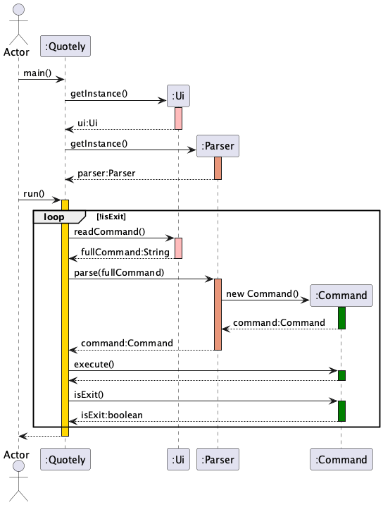
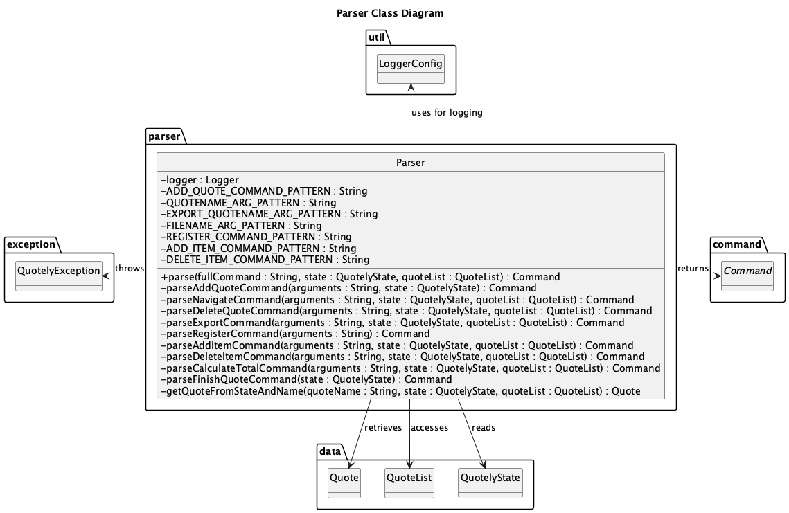
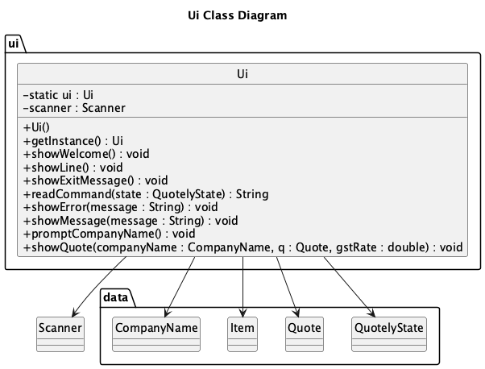
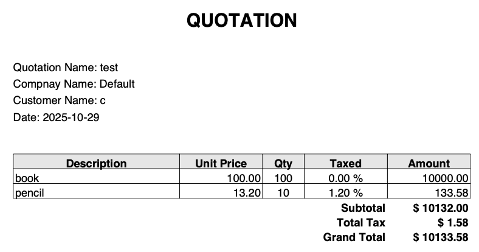
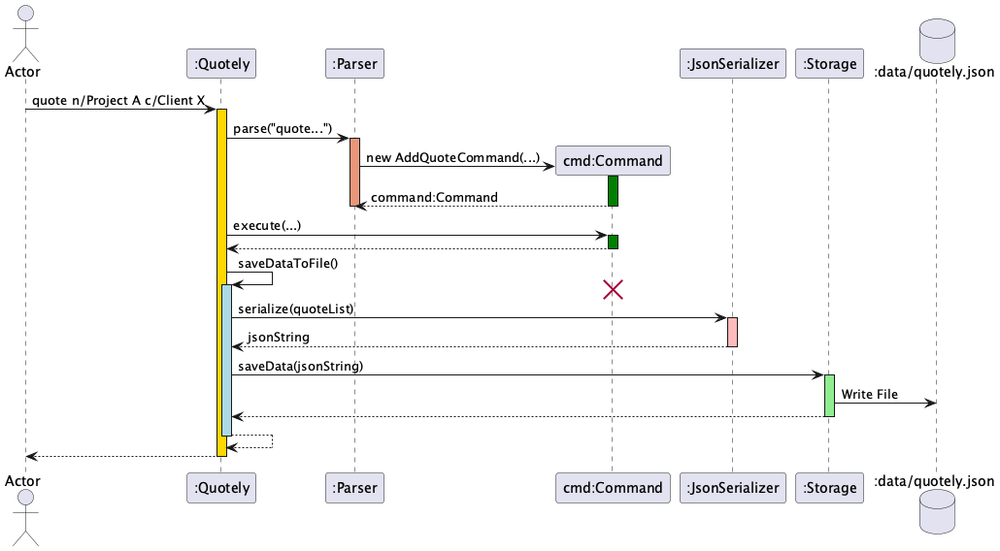

# Developer Guide

- [Developer Guide](#developer-guide)
  - [Acknowledgements](#acknowledgements)
  - [Design](#design)
    - [Architecture](#architecture)
    - [Parser Component](#parser-component)
    - [Command Component](#command-component)
    - [Ui Component](#ui-component)
    - [Data Component](#data-component)
    - [File storage Component](#file-storage-component)
    - [Writer Component (PDF export)](#writer-component-pdf-export)
  - [Implementation](#implementation)
    - [QuotelyState feature](#quotelystate-feature)
      - [Design Considerations](#design-considerations)
      - [Implementation of state](#implementation-of-state)
    - [Export feature](#export-feature)
      - [Overview](#overview)
      - [User-facing behaviour](#user-facing-behaviour)
      - [Example (full workflow)](#example-full-workflow)
      - [Developer notes (implementation)](#developer-notes-implementation)
      - [Implementation considerations \& TODOs](#implementation-considerations--todos)
    - [hasTax \& tax-handling feature](#hastax--tax-handling-feature)
      - [User-facing behaviour](#user-facing-behaviour-1)
      - [Error cases and expected behaviour](#error-cases-and-expected-behaviour)
    - [Gson implementation in File Storage](#gson-implementation-in-file-storage)
      - [Overview](#overview-1)
      - [Trigger](#trigger)
      - [User-facing behaviour](#user-facing-behaviour-2)
      - [Example (full workflow of File Storage)](#example-full-workflow-of-file-storage)
      - [Developers note (Implementation of File Storage)](#developers-note-implementation-of-file-storage)
      - [#### Implementation considerations \& TODOs](#-implementation-considerations--todos)
  - [Notes](#notes)
  - [Product scope](#product-scope)
    - [Target user profile](#target-user-profile)
    - [Value proposition](#value-proposition)
    - [User Stories](#user-stories)
  - [Non-Functional Requirements](#non-functional-requirements)
  - [Glossary](#glossary)
  - [Instructions for manual testing](#instructions-for-manual-testing)
  - [Documentation, logging, testing, configuration, dev-ops](#documentation-logging-testing-configuration-dev-ops)

## Acknowledgements

Many thanks to the CS2113 teaching team: Prof Akshay and our TA Luo Yu!

* AddressBook Level 3 [(AB3)](https://github.com/se-edu/addressbook-level3) was used as reference for the Developer
  Guide
  and User Guide.

* Course website [(CS2113 AY25/26)](https://nus-cs2113-ay2526s1.github.io/website/schedule/timeline.html) was used as
  reference for diagram construction and design principles.

* PlantUML [Guide](https://se-education.org/guides/tutorials/plantUml.html) was used for generating diagrams.

## Design

### Architecture

Our Quotely application uses a layered architecture approach where each layer of the architecture are represented by a
component. Each component uses the sole responsibility principle (SRP), focusing on specific areas of work in the code.

* For example, UI deals with user input and output only

This approach is similar to the reference AddressBook AB3 which follows a similar style of abstraction and grouping of
classes. The key benefits of the design with SRP is modular and easy-to-maintain code. This also allows the developers
to split the work in well-defined chunks of code. The architecture is explained in diagrams with progressively greater
levels of detail.

The architecture diagram below shows an overview of the main components.


The class diagram below show a simplified overview class diagram that represents the primary relationship between all
classes.


The program work is done by the following main components:

* `Quotely`
    * Launches and Exit.
    * Serves as the central coordinator across all layers.
    * Initialises and connects the Parser, Ui, Storage, and LoggerConfig.
    * Delegates user input to the Parser and executes the resulting Command.
    * Manages persistence via JsonSerializer and Storage.
    * Ensure consistent state between memory (QuoteList) and local disk file.
* `Parser`
    * Parses user CLI input
    * Identifies command type and extracts arguments.
    * Instantiates the appropriate Command subclass.
    * Handles input validation and formatting errors.
    * Throw QuotelyException for invalid commands.
* `Command`: Perform data mutation, Ui navigation.
    * Executes specific application task based on user command.
        * Mutation on Quote, QuoteList, or Item.
        * Interact with external modules like PDFWriter for PDF Export.
        * Update QuotelyState to manage workflow context.
        * Uses Ui to print results or feedback to the user.
* `Ui`:
    * Displays text-based output to the user.
    * Receive user input and return to Quotely.
* `Data`: Store quote and item data.
* `File storage`: Handle persistence of application data.
* `Util`: Logger configuration

The sequence diagram below shows the main loop which runs continuously in Quotely until an `exit` command is given by
the user.



Loop sequence explanation:

1. User input is fetched from `Ui`
2. input is fed into `Parser`
3. `Parser` determines appropriate `Command` type to create. Returns new command object with appropriate parameters set
   to Quotely
4. Quotely runs the execute method in `Command`

The above process runs until `Exit` is read from the user.

Sequence diagram example of component interaction when the user adds one quote, and then add one item
to that quote:


### Parser Component

The Parser acts as the command dispatcher for all user inputs.

* It begins by examining the first keyword in the input (e.g., add, delete, quote, register).
* Once the command word is recognised, the Parser extracts and validates additional arguments using predefined regular
  expression patterns.
* Each parsed command is then transformed into a specific Command subclass (such as AddItemCommand or NavigateCommand),
  with arguments passed during new Command initialisation.
* Responsible for allowing/disallowing commands which are not valid in the current state.
    * For example, "finish" a quote is not allowed in main menu (as there is no quote being edited!)

The class diagram of the `Parser` component is shown below:



How the `Parser` component works:

1. When user inputs "add n/01 c/joe", the input is passed from Ui Component to Parser Component.
2. `Parser` checks for valid command format and runs method to parse command based on command keyword, which is "add"
   for this example.
3. The respective method is run to parse the command and set up attributes for the corresponding Command type
4. This results in a `Command` object created (more precisely, an object of one of its subclasses e.g., AddQuoteCommand)
   which is executed in Quotely.
5. The command can communicate with `Data` when it is executed (e.g. to add a quote). Note that although this is shown
   as a single step in the diagram above (for simplicity), in the code it can take several interactions (between the
   command object and the Data) to achieve.
6. The result of the `Parser` execution is encapsulated as a Command object which is returned back from `Parser`.

### Command Component

The Commands define the executable actions that form the logic of Quotely.

* Each user operation is a distinct subclass of the abstract Command class.
* Each subclass (such as AddQuoteCommand, DeleteItemCommand, or ExportQuoteCommand) implements the execute() method to
  perform a specific function, such as adding a quote, deleting an item, or exporting data to PDF.
* The base Command class defines `execute()` to handle all commands polymorphically.

The class diagram of the `Command` component is shown below:


How the `Command` component works:

* After Parser finishes interpreting a user’s input, it returns an appropriate Command subclass object to Quotely.
* Quotely then invokes the execute() method on that Command object.
* Each command performs a single, well-defined operation.
    * AddQuoteCommand — Creates a new Quote object and adds it to the QuoteList.
    * AddItemCommand — Adds a new Item (with price, quantity, and tax rate) to a specific Quote.
    * DeleteItemCommand — Removes a specified Item from a Quote.
    * DeleteQuoteCommand — Deletes an entire Quote from the QuoteList.
    * CalculateTotalCommand — Calculates the total cost of all items in a quote, including taxes, and displays it via
      the Ui.
    * ExportQuoteCommand — Uses PDFWriter to generate a PDF quotation, saved to local disk.
    * RegisterCommand — Updates the CompanyName.
    * NavigateCommand — Switches between editing contexts (e.g., main menu vs. a specific quote) by
      updating QuotelyState.
    * FinishQuoteCommand — Finalises a quote, and return to main menu (update QuotelyState).
    * SearchQouoteCommand - Uses a keyword, finds all quotes which name contains keyword, and prints in CLI.
    * ShowQuotesCommand — Retrieves all quotes from QuoteList and prints in CLI.
    * ExitCommand — Signals the application to terminate safely.

### Ui Component

The Ui is responsible for all user-facing interactions (input and output)

* It is a singleton pattern, ensuring only one instance handles all console input and output.
* Handles all reading of user input via its private `Scanner` instance
* Defines methods for CLI output such as formatting complex data, like a Quote, into a readable, table-like format for
  the user like in `showQuote()`
* `Ui` is state-aware, changing its prompt in `readCommand()` (e.g., main > or quote_name > ) based on the QuotelyState

The class diagram of the `Ui` component is shown below:



How the `Ui` component works:

* When the program starts, Ui displays a welcome banner and prompts the user for input.
* The user enters a command through the console, readCommand() reads the input string.
* The input is then passed to the Parser component, which interprets it and returns a Command object.
* During Command execution, Ui methods are called to display result or any relevant messages to the user using
  showMessage() or showError().
* When the user exits the application, Ui.showExitMessage() prints a closing message before termination.

### Data Component

The Data component is responsible for storing program data (Quote, Item, CompanyName, QuotelyState) on memory while
Quotely is running. Each class provides the getters and setters for its attributes.

The class diagram of the `Data` component is shown below:


How the `Data` component works:

* CompanyName represents the registered company name of the user.
    * Used by showQuote() to print the business name on the generated quotation.
* Item represents an individual product or service in a quote
    * Each Item stores a description (itemName), a unit price, quantity, and an optional tax rate (can be left at 0.0%).
* Quote acts as a container for a single customer quotation.
    * It contains a list of Item objects, implemented using Arraylist
* QuoteList manages a collection of multiple Quote objects
    * QuoteList is referenced by both the Parser and Command components whenever user actions require accessing or
      modifying existing quotes.
    * Not implemented as a singleton pattern, so future updates may utilise multiple QuoteLists.
* QuotelyState represents the current program state.
    * It tracks whether the user is inside a quote or in the main menu (isInsideQuote()), and which quote is currently
      active (quoteReference).
    * Implemented as a singleton pattern

### File storage Component


The `Storage` component,

* handles the persistence of application data (the `QuoteList`) between sessions
* loads the `QuoteList` from a local JSON file (data/quotely.json) when the application starts
* saves the `QuoteList` back to the JSON file after each successful command
* comprised of a Storage class (for raw file I/O) and a JsonSerializer (for object-to-JSON conversion)
The Storage component is responsible for loading data from local disk at initialisation of Quotely and save changes to
Data back to local disk after user inputs have been successfully executed.

* Handles the persistence of application data (the `QuoteList`) between sessions.
* Loads the `QuoteList` from a local JSON file (data/quotely.json) when the application starts.
* Saves the `QuoteList` back to the JSON file after each successful command.
* Comprised of a Storage class (for raw file I/O) and a JsonSerializer (for object-to-JSON conversion).

The class diagram of the `File storage` component is shown below:


How the `File storage` component works:
* When Quotely starts, it initializes a Storage object with a file path.
* The Storage constructor ensures the directory exists and prepares the file for reading or writing.
* To load data, the application calls Storage.loadData(), whereby:
  * Reads JSON text from the file (if it exists).
  * Passes the text to JsonSerializer.deserialize().
  * Converts the JSON string into a QuoteList object containing all saved Quote and Item data.
* To save data after user commands, the application calls Storage.saveData(String data), whereby:
  * Uses JsonSerializer.serialize(quoteList) to convert the in-memory QuoteList into a JSON string.
  * Writes that string back into the data file, replacing any previous content.

The JSON storage format used by the `Storage` component (persisted in `data/quotely.json`) is shown below.
Each quote object contains `quoteName`, `customerName`, and an `items` array; each item object includes `itemName`,
`price`, `quantity`, and `taxRate`.

```
{
  "quotes": [
    {
      "quoteName": "quote 1",
      "customerName": "John Doe",
      "items": [
        {
          "itemName": "book",
          "price": 100.0,
          "quantity": 100,
          "taxRate": 0.0
        },
        {
          "itemName": "pencil",
          "price": 13.2,
          "quantity": 10,
          "taxRate": 1.2
        }
      ]
    }
  ]
}
```

### Writer Component (PDF export)

The Writer component (PDF export) transforms an in-memory `Quote` and related metadata (for example, `CompanyName`) into a printable PDF file. It is intentionally small and focused: callers supply the quote and an optional filename and receive a completed PDF on disk (or a clear error).

Responsibilities

- Produce a readable invoice/quotation layout (header, customer details, itemised table, subtotals, tax lines, footer).
- Accept a requested output filename (base name) and write a `.pdf` file to the target location.
- Sanitize filenames and paths to avoid path traversal and filesystem errors.
- Perform writes atomically where possible, and report failures to `Ui` while logging full details.

API and implementation notes

- Public API: a single writer class exposes a concise method such as `PDFWriter.writeQuoteToPDF(Quote quote, CompanyName company, String filename)` (the current implementation follows this pattern).
- Implementation style: the project currently uses a singleton-style `PDFWriter` implemented with iText/lowagie. The design intentionally keeps formatting code separate from parsing/command logic.

Filename rules (recommended)

- Input: the CLI accepts an optional `f/FILE_NAME` token. The command forwards the supplied base name to the writer.
- Normalisation steps the writer should perform:
  1. Trim whitespace from the supplied name.
  2. If the name ends with `.pdf` (any case), remove the extension so the writer can consistently append `.pdf`.
  3. Reject or strip path traversal segments (`..`) and disallow path separators (`/` or `\`) unless the writer explicitly supports writing to paths. If we accept a path, validate it carefully and document the behaviour. (future work)
  4. Replace or remove characters that are illegal on common filesystems. A practical whitelist is: letters, digits, space, hyphen (-), underscore (_), and dot (.). Example safe regex: `^[A-Za-z0-9 _\-\.]+$` (apply trimming and fallback for empty names). (future work)
- Final name: append `.pdf` and write to the destination. By default the current working directory is used; existing files are overwritten.

Developer TODOs (prioritised)

1. Implement and test filename sanitisation using the whitelist strategy above.
2. Decide on font strategy (bundle TTFs and register at runtime, or document required system fonts) and implement a font registration helper if needed.
3. Add an integration test that verifies `ExportQuoteCommand` produces a file in a temporary directory.

This writer component is intentionally small and replaceable: contributors can swap the underlying PDF production mechanism while preserving CLI behaviour (`ExportQuoteCommand`) and the `Ui` contract.

Here is the class diagram of `writer`:


## Implementation

This section highlights certain features of Quotely and delves into details on the implementations.

### QuotelyState feature

The QuotelyState feature is a helper for user interaction, implemented using a class within the Data component.

#### Design Considerations

The purpose of this feature is to fix the anticipated issue of user confusion by facilitating Ui elements for the user
to navigate between the `main menu` and`quote` state.

* In previous versions, if the user is working on `quote1`, there is no Ui element for the user to reference that the
  current situation is indeed "editing quote 1".
* The user may be in no quotes, or a different quote.
* This may become extremely messy and almost unusable if the number of quotes are large.

#### Implementation of state

To solve this problem, QuotelyState was introduced to allow additional Ui elements for the user to distinguish the
current situation.

* If the user is not editing any quote, it is considered as `main menu state`
* If the user is editing a quote, it is considered as `quote state`, whereby the QuotelyState object stores the quote
  reference
* In addition, we determine the type of user inputs allowable in each state. For example, finishing a quote is not
  allowed in `main menu state`

The following sequence diagram shows how an `add` operation uses the QuotelyState


The commands depend on QuotelyState in this manner:

* `register` : available in all state
* `quote` : main menu only
* `unquote` : can use no quote name if inside a quote
* `show` : available in all state as of v1.0
* `finish` : inside quote only
* `delete` : can use without quote name if inside a quote
* `add` : can use without quote name if inside a quote
* `total` : can use without quote name if inside a quote
* `nav` : available in all states, but need to specify target location e.g. 'main' or quoteName
* `exit` : available in all state as of v1.0

### Export feature

The export feature generates a PDF quotation from a Quote object. It is intended to let users produce a printable,
shareable PDF of the quote they have composed in the CLI.

#### Overview

- Triggered by the `export` command. When executed, the application delegates formatting and file creation to the PDF
  writer component.
- Current implementation writes a file named `invoice.pdf` to the working directory (see implementation notes below).

#### User-facing behaviour

- If the user is inside a quote (editing a specific quote), they may run the command without arguments to export the
  active quote:

```
export
```

- If the user is in the main menu, they must specify the quote name to export:

```
export n/QUOTE_NAME
```

- The user may explicitly set the output file name with `f/FILE_NAME`. When provided the writer will use that base name
  and append the `.pdf` extension if missing. Flags may be supplied in any order (for example `export f/Offer n/quote_1`
  or `export n/quote_1 f/Offer`).

#### Example (full workflow)

1. Create a quote and add items:

```
quote n/office chairs c/Acme Ltd
add i/Chair p/45.00 q/10
add i/Wheels p/2.50 q/40
```

2. Export the active quote (inside quote) or use the named export from main:

```
export
```

or

```
export n/office chairs
```

The sequence diagram below illustrates the steps taken when the `export` command is executed.


When the export completes, the application generates a PDF file named `quotation.pdf` in the working directory. The PDF
uses an quotation-style layout that includes header information and an itemised table showing each item's description,
quantity, unit price, tax, and computed amounts (subtotal, tax, and grand total).

Preview of the generated PDF:



#### Developer notes (implementation)

- Command: `seedu.quotely.command.ExportQuoteCommand` (parses the `export` command and constructs the command object).
  The command accepts an optional filename parameter and passes it to the writer. See
  `src/main/java/seedu/quotely/command/ExportQuoteCommand.java`.
- Writer: `seedu.quotely.writer.PDFWriter` handles PDF generation. The current method
  `writeQuoteToPDF(Quote, CompanyName, String filename)` accepts a filename base (the method will append `.pdf`) and
  writes the file into the current working directory. See `src/main/java/seedu/quotely/writer/PDFWriter.java`.
- Logging: the command logs via the centralised `LoggerConfig` utility.

#### Implementation considerations & TODOs

- Output filename is supported via `f/FILE_NAME` (the CLI accepts an explicit filename and the writer appends `.pdf` if
  needed). Consider sanitising the filename (remove path traversal characters), supporting explicit paths, and adding
  collision-avoidance behaviour.
- Add a Ui confirmation with the full path of the created file (already partially implemented in the command; ensure it
  uses an absolute path).
- Improve templates and styling (header/footer, company logo, multiple page handling).
- Add tests around the command parsing and delegate behaviour; avoid asserting file contents in unit tests (use
  integration tests or file-existence checks).

### hasTax & tax-handling feature

The hasTax feature checks whether an item in a quote is taxed, and the tax-handling
features enables items in a quote to have an individual tax
rate assigned to them.

The purpose of this feature is to give more functionality to users in scenarios where the item they are adding
has a certain tax rate assigned to them, and allow them to include the tax in calculations of the total cost of a quote.

In previous versions, there was no tax field for items, which overlooked cases where a user would have
to input an item into a list that has a tax rate. Therefore, only the individual cost of an item before tax was
accounted for in the calculation of the total cost.

Therefore, to solve this problem, a `taxRate` attribute of `double` type was added to the `Item` class, and users now
had the choice to either
add a tax rate to their item anywhere from `0.00%` to `100.00%`, or have it at `0.00%` by default if not stated.

Furthermore, an `hasTax` method has been added to the `Item` class as well that returns `true` if the Item has a tax
rate higher than `0.00%`, and `false` otherwise.

So far, only the `add` command modifies the `taxRate` attribute of an Item, and the `total` command depends on the value
of `taxRate` in calculating the total cost of a quote.

#### User-facing behaviour

- If a user is already inside a quote and wants to add an item without any tax, they can do so as before,
  without having to specify the tax rate:

```
add i/Chair p/45.00 q/10
```

This sets `taxRate` to its default value `0.00%`.

- Now, if the user wants to add an item with a certain tax rate, e.g. `5.00%`, they'd have to specify it in the add
  command as such:

```
add i/Chair p/45.00 q/10 t/5.00
```

This sets `taxRate` to a value of `5.00%`.

The sequence diagram below shows what happens when a user executes the `add` command with the tax rate of `5.00%` as
shown in the example right above (zoom in if necessary):


This features allows to calculate installments based on the Principal (amount of loan), interest rate and number of
payments.

#### Error cases and expected behaviour

Below are common invalid inputs the parser and validation layers guard against, with examples and the expected outcome.
The `Parser` performs structural validation (right flags, required fields) and numeric parsing; numeric/semantic checks
also throw `QuotelyException` with `ErrorType.INVALID_NUMBER_FORMAT` when numbers are malformed or out of valid range.

- Missing item name (flag `i/` omitted)

```
add p/45.00 q/10
```

Expected: Parser fails with WRONG_COMMAND_FORMAT; user is prompted with the correct format:
`add i/ITEM_NAME [n/QUOTE_NAME] p/PRICE q/QUANTITY [t/TAX_RATE]`.

- Non-numeric price

```
add i/Chair p/abc q/10
```

Expected: Parser throws INVALID_NUMBER_FORMAT (price parse error). The Ui should display an error explaining price must
be a decimal number.

- Negative price

```
add i/Chair p/-5.00 q/2
```

Expected: Parser throws INVALID_NUMBER_FORMAT (price must be non-negative). The Ui should explain price cannot be
negative.

- Non-numeric or negative quantity

```
add i/Chair p/45.00 q/xyz
add i/Chair p/45.00 q/-2
```

Expected: Parser throws INVALID_NUMBER_FORMAT. Quantities must be positive integers.

- Invalid tax rate (non-numeric or out of range)

```
add i/Chair p/45.00 q/10 t/abc
add i/Chair p/45.00 q/10 t/-1
add i/Chair p/45.00 q/10 t/150
```

Expected: Parser throws INVALID_NUMBER_FORMAT for non-numeric values or values outside the allowed range (e.g., <0 or >
100). Ui should instruct tax rate must be a percentage between 0 and 100.

- Missing price or quantity flags

```
add i/Chair q/10
add i/Chair p/45.00
```

Expected: Parser fails with WRONG_COMMAND_FORMAT; show the correct command format.

### Gson implementation in File Storage

The file storage feature ensures all data is saved to local file preventing data
loss between `Quotley` uses. This is accomplished using the Gson library to serialize data into
a JSON format.

#### Overview

- The feature is built around com.google.code.gson, a library that handles data-to-JSON conversion.

- Gson is used to automatically convert the `QuoteList` object (and all its nested `Quote` and `Item` objects)
  into a JSON string, and vice versa.

#### Trigger

- **Load**: The application reads and deserializes the JSON file on startup, loading the `QuoteList` into memory.

- **Save**: The application serializes and overwrites the JSON file after every successful command,
  ensuring data is always in sync.

#### User-facing behaviour

- The feature is almost entirely transparent to the user.
- On first launch, **if the data file is not found**, the app logs a warning (`WARNING: Data file not found...`)
  and starts with a fresh, empty `QuoteList`.
- After the first data-modifying command (`e.g., quote ...`),
  the data file (`e.g., data/quotely.json`) is created.
- On all subsequent launches, the user's previous data is loaded, and no warning is shown.

#### Example (full workflow of File Storage)

1. User starts `Quotely` for the first time. The console logs a warning that the data file was not found.
   (If the `data/quotley.json` file is not inside)
2. User adds a new quote: `quote n/Project A c/Client X`
3. The application saves the new `QuoteList` (containing "Project A") to `data/quotely.json`.
4. User `exits`
5. User starts `Quotely` again.
6. This time, no warning is logged (Since the file is already created). The `Storage` component finds and reads the
   file.
   The `JsonSerializer` (using Gson) parses the data.
7. User runs `show`
8. The UI displays "Project A", confirming the data was successfully loaded.

The sequence diagram below illustrates the loading process at startup and the saving process after a command.



#### Developers note (Implementation of File Storage)

- **Core Library (Gson)**: This feature is powered by Google's Gson library `com.google.code.gson:gson:2.10.1`.
- **Serialization** : Gson's primary role is **serialization** , automatically converting the live Java `QuoteList`
  object (and all its nested
  `Quote` and `Item` objects) into a structured JSON string.
- **Deserialization** : It also handles **deserialization** which parses the JSON string from the file back into a fully
  functional `QuoteList` object when `Quotley` starts
- **Why Gson ?** : Gson was used because it automates this complex conversion. Instead of creating a parser for
  convertion, `gson.toJson(quoteList)`
  method is called to save data and `gson.fromJson(json, QuoteList.class)` to load data. This logic is encapsulated in
  the `seedu.quotely.storage.JsonSerializer` class.
- **File I/O** : The `seedu.quotely.storage.Storage` class handles all raw file I/O operations (Read and Write).
- The `GsonBuilder().setPrettyPrinting().create()` method is used to make the to make the saved quotely.json file
  human-readable, which aids in debugging.

#### #### Implementation considerations & TODOs

- **Efficency** : The current "save-on-every-command" strategy is simple and robust but could become inefficient if
  `QuoteList` grows to thousands entries.
- **Error Handling** : If the `quotely.json` file becomes corrupted (e.g., manual edit breaks the JSON syntax),
  the app will log an error and start with a fresh `QuoteList`, overwriting the corrupted file on the next save.

Notes
-----

- These checks are implemented in `Parser.parseAddItemCommand(...)` and will raise `QuotelyException` with the
  appropriate `ErrorType`. Keep user-facing messages clear and prescriptive (show the expected format and which token is
  invalid).
- For robust UX, consider adding unit tests that assert the parser rejects these inputs and that the Ui shows the
  intended help/error messages.

## Product scope

### Target user profile

1) a user who can accomplish most tasks faster via a command line interface (CLI)
2) sales worker who handles quotation and invoicing
3) small business owner starting out and does not use paid quotation software yet
4) wants to send quotation as text or PDF, instead of using chat text

### Value proposition

Current methods of quotation by small businesses use Excel or other manual methods (for
example: type manually on whatsapp, telegram chat) to generate quotations.

Quotely is a free CLI based Quotation generator that allows users in sales to handle quotations for free without using
paid quotation generator software. Quotations are stored, and offers ability to manage quotations faster than using
informal tools such as social media
chat.

### User Stories

| Version | As a ...                                                                 | I want to ...                                   | So that I can ...                                                      |
|---------|--------------------------------------------------------------------------|-------------------------------------------------|------------------------------------------------------------------------|
| v1.0    | sales worker                                                             | add items to quote                              | keep track of items in the quote                                       | 
| v1.0    | sales worker                                                             | delete item from quote                          | keep track of items in the quote and get rid of wrong or outdated info |
| v1.0    | small online merchant that uses whatsapp and telegram to quote customers | generate quotes in text form                    | save time typing the full format                                       |
| v1.0    | new user                                                                 | view my quotations and sales                    | have better oversight of my own work                                   |
| v1.0    | sales worker                                                             | auto sum the total amount and calculate the tax | send a finished quote                                                  |
| v2.0    | business owner or accountant                                             | set customised Tax rate for each item           | add non taxed items to quote                                           |
| v2.0    | user                                                                     | save quotes on to local drive                   | can save data between sessions of use                                  |
| v2.0    | user                                                                     | export quote as PDF                             | send quotes to clients as PDF                                          |
| v2.0    | user                                                                     | show particular quote                           | save time searching when I have many quotes                            |
| v2.0    | user                                                                     | add business/customer address                   | include more info in the quotation                                     |
| v2.1    | user or accountant                                                       | calculate installments                          | save time from manually calculating                                    |
| v2.1    | user or accountant                                                       | perform currency conversions                    | quote internationally                                                  |
| v2.1    | user                                                                     | have different PDF and text templates           | have different quotation formats                                       |

## Non-Functional Requirements

* Data: non-volatile, does not get corrupted with use
* Data: user should be able to store at least 50 quotes
* Data: total sum and tax calculations must be accurate
* Technical requirements: should be able to work on Windows and Mac as (common OSes)
* Performance requirements: the responses to user input should not take more than 500ms
* Debugging: the admin or developer should be able to view a log of activities

## Glossary

* *glossary item* - Definition

## Instructions for manual testing

{Give instructions on how to do a manual product testing e.g., how to load sample data to be used for testing}

## Documentation, logging, testing, configuration, dev-ops

- [Logging guide](./Logging.md)
- [Diagram guide](./DiagramGuide.md)